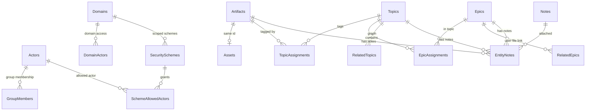

# KFS — Architecture

**Package:** `sit/kfs/`  
**Version context:** Schema v2.0 (Actor / Domain security model)  
**Date:** 2026-06-30

This document describes how the Kaizen Filing System (KFS) is structured internally — databases, permission flow, code layout, and cross-cutting mechanics. For the security model from a user perspective, see [kfs_guide.md](kfs_guide.md). For build instructions, see [COMPILATION_GUIDE.md](COMPILATION_GUIDE.md).

---

## 1. Purpose and design goals

KFS is a **domain-isolated, ACL-secured content store** embedded in Situation as a standalone static library. It persists:

- **Actors** (users, groups, companies) and their memberships
- **Domains** as isolation boundaries (“firewalls”)
- **Security schemes** as reusable permission templates
- **Content entities** — Artifacts (with binary/text payloads), Topics, Epics, Notes — and the links between them

Design constraints that shaped the architecture:

| Goal | How it is achieved |
|------|-------------------|
| Fine-grained access control | `kfs_check_permission` — domain gate → admin bypass → ownership → scheme grants |
| Large blob storage | Split `architecture.db` (metadata) from `artifacts.db` (BLOB/TEXT payloads) |
| Single-process embedding | Three SQLite file handles in one `GameDB`; no server |
| Header-only ergonomics for consumers | MyBuddy-style `KFS_IMPLEMENTATION` gate in one TU |
| Traceability | Public APIs registered in `situation_base_trace.h` (IDs unchanged across refactor) |

---

## 2. Package structure

```
sit/kfs/
├── kfs/                       # Source (only)
│   ├── kfs.h                  # Public orchestrator: api + optional impl
│   ├── kfs_version.h          # Library version macros (canonical)
│   ├── kfs_mem.h              # Unified heap: KFS_* macros + kfs_mem_* API
│   ├── kfs_api.h              # Types, status codes, ~122 declarations
│   ├── kfs_impl.h             # Impl orchestrator — include chain only (~22 lines)
│   ├── kfs_impl_fwd.h         # Cross-module static forward declarations
│   ├── kfs_impl_core.h        # Platform, DB lifecycle, utilities, memory frees
│   ├── kfs_impl_auth.h        # registry.db — actors, domains, schemes, permission
│   ├── kfs_impl_lc.h          # architecture + artifacts — content & linking
│   └── kfs.c                  # #define KFS_IMPLEMENTATION + #include "kfs.h"
├── build/                     # link-check / api-check sources; obj + libkfs.a + binaries
├── scripts/
│   ├── sync_api.py            # Regenerates kfs_api.h from impl signatures (S7: multi-fragment)
│   ├── check_kfs_mem.py       # Build gate: raw CRT allocators in kfs_impl_*.h (M5)
│   ├── s3_extract_core.py     # Split replay scripts (reference)
│   ├── s4_extract_auth.py
│   └── s5_extract_lc.py
├── tests/                     # Runtime harness — 55 tests (H0–H7), see test_harness_plan.md
└── doc/                       # Manuals + [done/](done/) archived plans
```

**Consumer include path:** `-I sit/kfs` + `#include "kfs/kfs.h"`.

---

## 3. Compile and link model

KFS follows the same pattern as MyBuddy:

```c
// Exactly one .c file (kfs/kfs.c):
#define KFS_IMPLEMENTATION
#include "kfs/kfs.h"

// All other TUs:
#include "kfs/kfs.h"   // types + declarations only
```

`kfs.h` includes `kfs_api.h` always; when `KFS_IMPLEMENTATION` is defined it also pulls in `kfs_impl.h`, which chains four implementation fragments (see §7).

The static archive `build/libkfs.a` bundles:

- `kfs.o` — entire implementation (from `kfs.c` → `kfs_impl.h` → core / auth / lc)
- `sqlite3.o` — amalgamation from `ext/sqlite3.c`

Consumers link `-lkfs` once; SQLite is already inside the archive.

---

## 4. Three-database architecture

`GameDB` holds three independent SQLite connections. There are **no enforced cross-database foreign keys** — consistency is maintained by application logic using matching integer IDs (especially `Artifacts.id` == `Assets.id`).

```c
typedef struct {
    sqlite3* artifacts_db;  /* artifacts.db — payload blobs */
    sqlite3* arch_db;       /* architecture.db — metadata + graph */
    sqlite3* registry_db;   /* registry.db — actors, domains, ACLs */
} GameDB;
```

### 4.1 Why three files?

| File | Role | Rationale |
|------|------|-----------|
| **registry.db** | Identity, domains, security | Small, frequently joined for permission checks |
| **architecture.db** | Entity metadata and relationships | Structured graph (topics ↔ artifacts ↔ epics) |
| **artifacts.db** | `Assets` table only | Large BLOBs separated from metadata queries |

`kfs_init` opens all three, enables `PRAGMA foreign_keys = ON` on registry and architecture DBs, and runs `CREATE TABLE IF NOT EXISTS` plus index creation (schema v2.0).

### 4.2 Entity-relationship overview



---

## 5. Schema by database

### 5.1 registry.db

| Table | Purpose |
|-------|---------|
| **Actors** | Users, groups, companies (`uuid`, `actor_type`, `name`, `role`, `is_active`) |
| **GroupMembers** | `(group_actor_id, member_actor_id)` many-to-many |
| **Domains** | Named isolation regions (`owner_actor_id`, `creator_uuid`) |
| **DomainActors** | Which actors (or groups) may enter a domain |
| **SecuritySchemes** | Named ACL templates, scoped by `domain_id` |
| **SchemeAllowedActors** | Per-actor `can_read` / `can_write` / `can_delete` flags |

**AdminGroup** is not a separate table — it is a row in `Actors` with `actor_type = 'GROUP'` and `name = 'AdminGroup'`. Membership in that group triggers admin bypass in permission checks.

### 5.2 architecture.db

| Table | Purpose |
|-------|---------|
| **Artifacts** | Metadata: `domain_id`, `type`, `name`, `format`, owner, scheme, timestamps |
| **Assets** | *(lives in artifacts.db)* — see §5.3 |
| **Topics** | Named tags within a domain (`UNIQUE(name, domain_id)`) |
| **Epics** | Higher-level narrative groupings (description, domain-scoped name) |
| **Notes** | Free-text annotations |
| **TopicAssignments** | `(artifact_id, topic_id)` |
| **EpicAssignments** | `(topic_id, epic_id)` |
| **RelatedTopics** | Directed topic graph (`is_subtopic` flag) |
| **RelatedEpics** | Links user-file epics to domain epics |
| **EntityNotes** | Polymorphic `(entity_type, entity_id, note_id)` |

Every content row carries `domain_id`, `owner_actor_id`, `creator_uuid`, and optional `security_scheme_id` for permission evaluation.

### 5.3 artifacts.db

| Table | Purpose |
|-------|---------|
| **Assets** | `id` (PK, matches `Artifacts.id`), `data` BLOB, `text_data` TEXT, `metadata` JSON TEXT |

The split insert path:

1. `INSERT` into `architecture.db.Artifacts` → `sqlite3_last_insert_rowid` → `artifact_id`
2. `INSERT` into `artifacts.db.Assets` with the same `id`

`kfs_save_asset` (static) performs this pair inside the caller's transaction. Legacy `kfs_save_text` / `kfs_save_file` wrap transactions around the same helper.

---

## 6. Permission engine

Almost every mutating and loading API calls `kfs_check_permission` (directly or via a wrapper) before touching entity data.

### 6.1 Permission types

```c
#define KFS_PERM_READ    1
#define KFS_PERM_WRITE   2
#define KFS_PERM_DELETE  3
```

### 6.2 Evaluation pipeline

`kfs_check_permission(db, requesting_user_uuid, entity_type, entity_id, permission_type)` executes in order:

```
1. Resolve requester     Actors.uuid → id; reject if inactive
2. AdminGroup check      member of GROUP named "AdminGroup"?
3. Load entity context   domain_id, owner_actor_id, security_scheme_id
                         (table chosen by entity_type string)
4. Domain firewall       DomainActors direct OR group-in-domain membership
5. Admin bypass          if step 2 → GRANT
6. Ownership             requester == owner, or member of owner GROUP/COMPANY
7. Security scheme       SchemeAllowedActors direct grant, then group grant
8. Deny                  KFS_PERMISSION_DENIED
```

Supported `entity_type` strings include `"Artifact"`, `"Topic"`, `"Epic"`, `"Note"`, `"Domain"`, `"SecurityScheme"`. Architecture entities use `architecture.db`; registry entities use `registry.db`.

### 6.3 Domain firewall detail

Before ownership or scheme logic runs, the requester must have **domain access**:

- Direct row in `DomainActors`, or
- Membership in a `GROUP` / `COMPANY` actor that appears in `DomainActors` for that domain

Failure returns `KFS_PERMISSION_DENIED` even if the user would otherwise own the entity.

### 6.4 Admin bypass

`AdminGroup` membership short-circuits after the domain firewall passes. Admins do **not** automatically bypass the domain firewall — they must still be in `DomainActors` (directly or via a group).

---

## 7. Implementation layout

The former **~13.9k-line** monolithic `kfs_impl.h` is split into four bodies plus a thin orchestrator (migration **S0–S6 complete** — see [done/impl_split_plan.md](done/impl_split_plan.md)).

| File | Lines (approx.) | Responsibility |
|------|-----------------|----------------|
| `kfs_impl.h` | 22 | Orchestrator — include chain only |
| `kfs_impl_fwd.h` | 23 | Cross-module `static` forward declarations |
| `kfs_impl_core.h` | 956 | Platform shims, `kfs_init`/`kfs_close`, utilities, memory frees |
| `kfs_impl_auth.h` | 5,278 | **registry.db** — actors, domains, schemes, `kfs_check_permission` |
| `kfs_impl_lc.h` | 6,106 | **Linking & content** — epics, topics, notes, artifacts, loaders, `kfs_validate_script` |

### 7.1 Include chain

Only `kfs_impl.h` includes the fragments. Order is fixed:

```
kfs_api.h → kfs_impl_fwd.h → kfs_impl_core.h → kfs_impl_auth.h → kfs_impl_lc.h
```

| Module | May call | Must not |
|--------|----------|----------|
| **core** | SQLite, CRT helpers | `kfs_check_permission` |
| **auth** | core helpers, permission engine | LC entity mutations |
| **lc** | core + `kfs_check_permission` | — |

No impl fragment `#include`s another fragment — the orchestrator alone defines visibility order.

### 7.2 Static-only internals

These are **not** in `kfs_api.h`. Cross-module helpers are forward-declared in `kfs_impl_fwd.h`; module-local `static` helpers stay in their fragment.

| Helper | Module | Role |
|--------|--------|------|
| `exec_sql`, `generate_kfs_uuid_64`, `get_user_id*` | core | SQL wrapper, UUID, user lookup |
| `check_group_admin_or_owner_perm`, `get_active_actor_info_by_uuid` | auth | Group admin guard, actor resolution |
| `kfs_save_asset`, `kfs_load_asset_list` | lc | Dual-DB insert, asset hydration |
| `kfs_get_topic_id_by_name`, `kfs_get_epic_id_by_name` | lc | Domain-scoped name lookup |
| `kfs_link_topic_to_artifact_by_name_internal` | lc | Topic link without permission (legacy save) |

Regenerate public declarations after signature changes: `scripts/sync_api.py` (today reads orchestrator only — **S7** will scan core + auth + lc).

### 7.3 Pre-split reference

Before 2026-06-30, all bodies lived in one `kfs_impl.h`. Section banners (epic, note, advanced-load duplicated) and line-level map are archived in [done/impl_split_plan.md](done/impl_split_plan.md) §5 and git history. Behavior and SQL were unchanged during relocation.

---

## 8. Transaction patterns

Multi-step operations use **paired transactions** on the databases they touch:

```c
exec_sql(db->artifacts_db, "BEGIN IMMEDIATE;", "artifacts");
exec_sql(db->arch_db,     "BEGIN IMMEDIATE;", "architecture");
// ... work ...
exec_sql(db->artifacts_db, "COMMIT;", "artifacts");
exec_sql(db->arch_db,     "COMMIT;", "architecture");
// on failure: ROLLBACK both
```

Permission-sensitive functions often begin transactions on `registry_db` + `arch_db` (and sometimes `artifacts_db`) because `kfs_check_permission` reads registry tables while entity data lives in architecture.

**Note:** Cross-database atomicity is **best-effort** (separate SQLite files). A crash between commits can leave metadata and payload temporarily inconsistent; higher-level recovery is not implemented.

---

## 9. Memory subsystem

KFS **2.3.0** routes implementation heap traffic and SQLite heap traffic through one backend (`kfs_mem`). See [memory_alloc_plan.md](memory_alloc_plan.md) for the migration record.

### 9.1 Layering

```
kfs_mem.h          KFS_MALLOC / KFS_FREE / kfs_mem_init / stats API
    ↓
kfs_impl_core.h    CRT backend (sole malloc/free/realloc island) + sqlite3_mem_methods vtable
    ↓
kfs_impl_{core,auth,lc}.h   all impl allocations via KFS_* (enforced by scripts/check_kfs_mem.py)
```

`kfs_mem_init()` installs the full SQLite `mem_methods` vtable (`xMalloc`, `xFree`, `xRealloc`, `xSize`, `xRoundup`, `xInit`, `xShutdown`) and enables `SQLITE_CONFIG_MEMSTATUS` before any `sqlite3_open`. `kfs_init()` calls `kfs_mem_init(NULL)` defensively if the embedder skipped step 1.

### 9.2 Init order (D4)

| Step | Call | Notes |
|------|------|-------|
| 1 | `kfs_mem_init(cfg)` | **Before** any KFS or `sqlite3_*` use in the process |
| 2 | `kfs_init(...)` | Opens three DB files; increments `open_db_count` |
| 3 | `kfs_close(db)` | Decrements `open_db_count` |
| 4 | `kfs_mem_shutdown()` | Only when `open_db_count == 0` |

Embedders that use SQLite outside KFS must call `kfs_mem_init()` first so all SQLite heap uses the same vtable.

### 9.3 Policy knobs (D3, D6)

| Field | Default | Runtime setter |
|-------|---------|----------------|
| `hard_limit_bytes` | `0` (unlimited) | `kfs_mem_set_hard_limit_bytes()` — also sets `sqlite3_soft_heap_limit64` |
| `max_open_db` | `0` (unlimited) | `kfs_mem_set_max_open_db()` — second `kfs_init` → `KFS_MISUSE` when at cap |
| `track_stats` | `1` | Set only at `kfs_mem_init` |

OOM at cap: alloc/realloc return `NULL`; optional `kfs_mem_set_oom_callback()`. Stats: `kfs_mem_bytes_in_use()`, `kfs_mem_peak_bytes()`, `kfs_sqlite_bytes_in_use()`, `kfs_mem_reset_peak()`.

### 9.4 Caller contract

- **Impl / API outputs:** allocate with `KFS_*`; caller frees API-returned pointers with `kfs_mem_free()` (or entity helpers that call it).
- **Macro overrides:** define `KFS_MALLOC` etc. before `#include "kfs_mem.h"` — changes impl only; SQLite still uses `kfs_mem_*` unless the CRT backend island is swapped (see `kfs_mem.h`).
- **Standalone (D7):** no `SIT_MALLOC` / Situation headers. Optional **production MyBuddy:** `-DKFS_MEM_USE_MYBUDDY` → `libkfs_mybuddy.a` with profile C (`MBD_FLAG_BUDDY_LARGE`, 256 MiB pool). H7 bench: ~25–40% faster reads vs CRT; ingest parity (see `memory_alloc_plan.md` §10).

### 9.5 SQLite heap exceptions (not in vtable)

Documented in plan §2.2 — budget and stats cover **intercepted heap** only:

| Mechanism | Routed? |
|-----------|---------|
| `mem_methods` (`sqlite3_malloc`, page cache, VDBE) | **Yes** |
| Per-connection **lookaside** slots | **No** — bulk buffer via vtable; slot recycle bypasses `xFree` |
| **`mmap` I/O** (`PRAGMA mmap_size`) | **No** — OS mapping |
| `SQLITE_CONFIG_PAGECACHE` static pool | **No** unless configured |
| Temp journal files on disk | **No** — file I/O |

Optional tuning (`SQLITE_CONFIG_LOOKASIDE`, `PRAGMA cache_size`) is embedder responsibility and does not change KFS allocator wiring.

### 9.6 Verification

| Check | How |
|-------|-----|
| No raw CRT in impl | `make mem-check` / `scripts/check_kfs_mem.py --enforce` |
| Vtable roundtrip | H0 `mem_roundtrip`, `mem_roundup_matches_sqlite` |
| Integrity under custom alloc | H0 `integrity_custom_alloc` |
| Heap cap / open-DB cap | H0 `mem_limit_triggers_oom`, `open_db_cap` |

---

## 10. Public API surface

`kfs_api.h` exposes ~122 functions grouped by concern:

| Family | Examples |
|--------|----------|
| Lifecycle | `kfs_init`, `kfs_close` |
| Actors / users | `kfs_add_actor`, `kfs_get_actor`, `kfs_create_god_user` |
| Domains | `kfs_add_domain`, `kfs_add_actor_to_domain` |
| Security | `kfs_create_security_scheme`, `kfs_add_actor_to_scheme`, `kfs_check_permission` |
| Artifacts | `kfs_create_artifact`, `kfs_load_artifact`, `kfs_delete_artifact` |
| Topics / epics / notes | CRUD + linking APIs |
| Loading | `kfs_load_by_topic`, `kfs_load_by_epic`, `kfs_list_artifacts_*` |
| Legacy | `kfs_save_text`, `kfs_save_file`, `kfs_create_artifact_and_asset` |

Status codes map closely to SQLite (`KFS_OK` == `SQLITE_OK`) with KFS-specific extensions:

- `KFS_PERMISSION_DENIED` (99)
- `KFS_INVALID_ARGUMENT` (100)
- `KFS_VALIDATION_FAILED` (101)

---

## 11. In-memory types

Key structs returned to callers (caller frees with `kfs_*_free` helpers; heap is `kfs_mem`):

| Struct | Represents |
|--------|------------|
| `KFS_Actor` | Single actor record |
| `KFS_Asset` | Artifact metadata + payload + loaded topics/notes |
| `KFS_Artifact` | Lighter artifact view (no topic/note arrays) |
| `KFS_Topic` / `KFS_Epic` / `KFS_Note` | Content entities with optional relations |
| `KFS_SecurityScheme` | Scheme + `KFS_AllowedActor[]` grants |
| `KFS_UserInfo` | Enriched user profile for admin UIs |
| `KFS_ArtifactInfo` | List iterator element |

`kfs_entity_free(void* entity, const char* entity_type)` is the unified destructor for loaded structs.

---

## 12. Legacy save path

`kfs_save_text`, `kfs_save_script`, and `kfs_save_file` predate the UUID-based requester convention:

- Take `owner_id` / `creator_id` as internal `Actors.id` values
- Do **not** accept `requesting_user_uuid` or `domain_id`
- Use `kfs_link_topic_to_artifact_by_name_internal` (no permission check) for topic assignment
- `kfs_save_asset` legacy inserts may omit `domain_id` on `Artifacts` (older code path without domain column in INSERT)

New code should prefer `kfs_create_artifact` and domain-scoped APIs. See [kfs_guide.md](kfs_guide.md) §7.2.

---

## 13. UUID generation

`generate_kfs_uuid_64(username, &uuid)` combines:

- Millisecond timestamp (~42 bits via `gettimeofday`)
- djb2 hash of username (22 bits)

Collisions are possible if two users share a name in the same millisecond. The library documents this limitation; production deployments may need an external UUID source in future revisions.

---

## 14. Platform shims

On Windows without MinGW's `sys/time.h`, `kfs_impl_core.h` provides a `gettimeofday` shim using `GetSystemTimeAsFileTime` for UUID generation and timestamp helpers.

`SQLITE_MAX_LENGTH` is defined in `kfs_api.h` when absent from `sqlite3.h` (used by `kfs_save_file` size guard).

---

## 15. Trace integration

KFS public functions are registered in `sit/situation_base_trace.h` (API block `10140001–10140121`, internal `20140001–20140117`). The structural refactor from `lib_kfs.h` did not renumber trace IDs.

`kfs_load_note` is in the API but not yet in the trace registry (pre-existing gap).

---

## 16. Known inconsistencies (technical debt)

| Item | Notes |
|------|-------|
| Parameter naming | API mixes `requesting_user_uuid` and `requesting_actor_uuid` (both `uint64_t`) |
| Legacy `kfs_save_*` | Bypass permission model; some artifact rows may lack `domain_id` |
| `Actors.role` column | Largely superseded by `AdminGroup` membership for admin checks |
| Cross-DB transactions | Not truly atomic across three SQLite files |
| `kfs_api.h` sync | Must run `scripts/sync_api.py` after impl signature edits |
| Situation integration | Not wired into `build_situation.bat` yet (AAA §9) |

---

## 17. Bootstrap sequence

First-time setup (from [kfs_guide.md](kfs_guide.md) §7.1):

0. `kfs_mem_init(NULL)` — optional if you only use KFS APIs (`kfs_init` calls it); **required** before any other `sqlite3_*` in the process
1. `kfs_init` — create/open three DB files
2. `kfs_add_actor` — create `AdminGroup` (GROUP)
3. `kfs_add_actor` — create first admin USER
4. `kfs_add_member_to_group` — grant admin privileges
5. `kfs_add_domain` — create primary domain; owner added to `DomainActors`

Alternatively, `kfs_create_god_user` automates steps 2–4 when no admin exists.

---

## 18. Verification

| Layer | What exists |
|-------|-------------|
| **Compile** | `make build` — `mem-check` + lib + link-check + api-check (`-Werror` on headers) |
| **Allocator gate** | `scripts/check_kfs_mem.py --enforce` — zero raw CRT in `kfs_impl_*.h` (CRT backend island only) |
| **Link smoke** | `kfs_link_check.exe` links `libkfs.a` |
| **Runtime harness** | **55/55** — [test_harness_plan.md](test_harness_plan.md) H0–H7 (44 correctness + 11 perf) |
| **Memory plan** | [memory_alloc_plan.md](memory_alloc_plan.md) — signed off M8 (2026-06-30) |
| **Perf baseline** | H7 p95 vs M0 log in `doc/done/mem_alloc_baseline_perf.log` (informal ≤10% gate) |
| **Split gate** | Post-S5 full suite; baseline logged in `doc/done/split_baseline_test.log` |

---

## 19. Related documents

| Document | Focus |
|----------|-------|
| [kfs_guide.md](kfs_guide.md) | Security model, worked examples, bootstrap |
| [clone_plan.md](clone_plan.md) | Clone & lineage (replica, registry, advisory sync) — planned |
| [COMPILATION_GUIDE.md](COMPILATION_GUIDE.md) | Build, link, make targets |
| [test_harness_plan.md](test_harness_plan.md) | Runtime test phases |
| [done/refactor_plan.md](done/refactor_plan.md) | `lib_kfs.h` refactor + impl split (archived) |
| [done/impl_split_plan.md](done/impl_split_plan.md) | Monolith → fwd/core/auth/lc migration (archived) |
| [memory_alloc_plan.md](memory_alloc_plan.md) | Unified heap migration (M0–M8, complete) |
| [`../../../doc/plan/AAA_ARCHITECTURE_PLAN.md`](../../../doc/plan/AAA_ARCHITECTURE_PLAN.md) | Situation-wide KFS integration roadmap |

---

## 20. Federation & cloning (planned)

Multi-site deployments treat each KFS node as an independent server with sparse local material. **Clone lineage** (global `artifact_uuid`, origin registry, revision advisory) is specified in [clone_plan.md](clone_plan.md). Not implemented in schema v2.0; see that document for security constraints (`KFS_PERM_CLONE`, immutable lineage, pull-based sync).