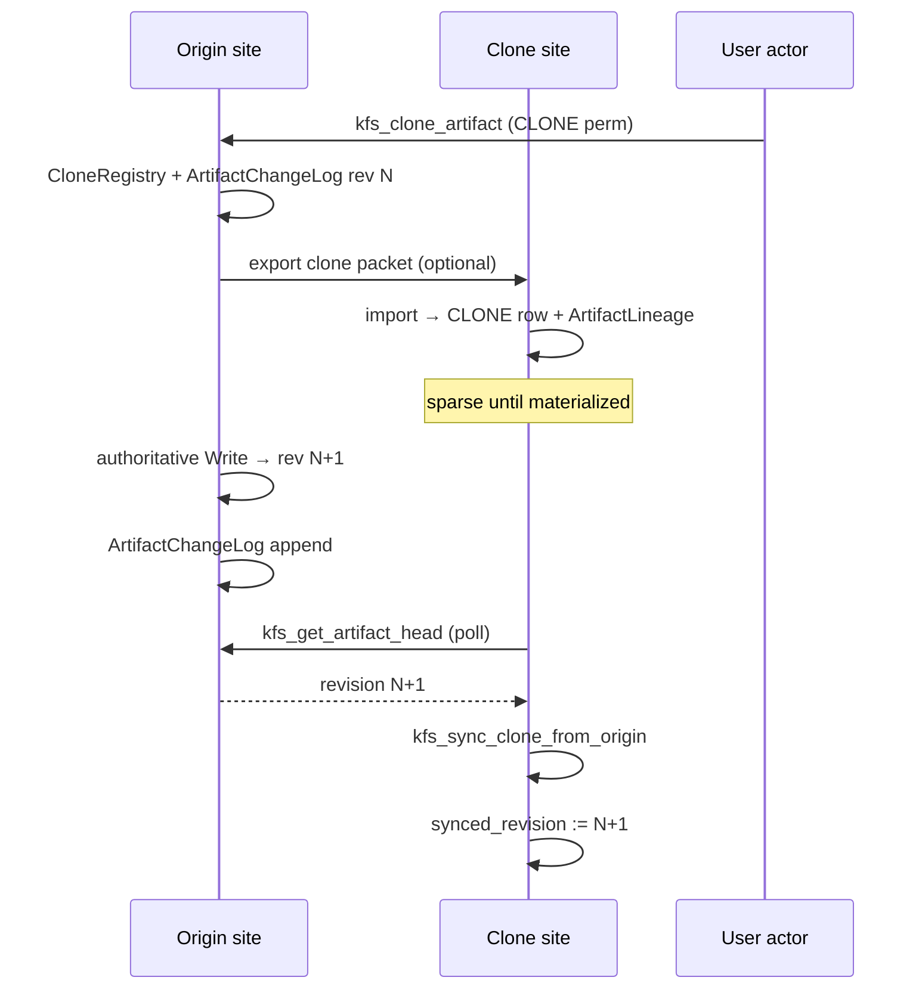

# KFS Clone & Lineage Plan

**Status:** 📋 Planning — schema and API not implemented  
**Date:** 2026-06-30  
**Scope:** Secure cloning with lineage backtracking, clone registry on originals, and change advisory to replicas — within the existing domain / ownership / scheme security model and multi-site federation goals.  
**Related:** [architecture.md](architecture.md), [kfs_guide.md](kfs_guide.md), [test_harness_plan.md](test_harness_plan.md), [done/refactor_plan.md](done/refactor_plan.md)

---

## 1. Problem statement

In a multi-site company (many KFS nodes, sparse material presence), a user with legitimate access may need a **local copy** of material whose **authoritative original** lives elsewhere.

That local copy must:

1. **Backtrack** to the original (identity + provenance, not a disconnected duplicate).
2. Allow the **original** to record **who cloned** (which actor, which site/node).
3. Allow the **original** to **advise clones** when the authoritative material changes (so replicas can refresh or mark themselves stale).

All of this must respect:

- Domain firewall  
- Ownership  
- Security schemes (Read / Write / Delete)  
- Admin bypass rules (admin still needs domain access)  
- No new exfiltration or permission-bypass paths  

Today KFS has `creator_uuid`, `owner_actor_id`, `created_at` / `updated_at`, and JSON `metadata`, but **no clone lineage, global material identity, revision stream, or clone registry**. See [architecture.md](architecture.md) §15.

---

## 2. Design principles

| Principle | Implication |
|-----------|-------------|
| **Original is authoritative** | Only the origin node may bump revision and emit change events. Clones are derivatives unless explicitly forked (out of scope v1). |
| **Clone ≠ copy permission** | `READ` alone is insufficient to clone. Cloning requires an explicit **`CLONE` grant** (or owner/admin on the original). |
| **Lineage is immutable** | Once established, `origin_artifact_uuid` + `origin_site_id` on a clone never change. |
| **Advisory, not push-by-default** | Origin records change; clones **pull** advisories. Fits “everyone is a server” — no central push broker required in v1. |
| **Domain firewall always first** | Cross-domain clone requires policy on **both** source domain and target domain. |
| **Fail closed** | Unauthorized clone request → `KFS_PERMISSION_DENIED` or `KFS_NOTFOUND` (same obscurity rules as today). |
| **Local `id` stays local** | Federation uses **global artifact UUID**, not SQLite `INTEGER PRIMARY KEY`. |

---

## 3. Terminology

| Term | Meaning |
|------|---------|
| **Site / node** | One KFS deployment (local trio of DB files). ~20 sites in the federation mental model. |
| **Original (authority)** | The artifact row whose `lineage_role = ORIGINAL` and whose revisions are canonical. |
| **Clone (replica)** | A derivative artifact with `lineage_role = CLONE`, pointing at an original UUID + origin site. |
| **Lineage** | Directed edge: clone → original (immutable). |
| **Revision** | Monotonic integer on the original; incremented on each authoritative content/metadata change. |
| **Advisory** | Origin-side record that revision N is available; clone compares to `synced_revision`. |
| **Materialization** | Clone holds metadata ± blob locally (stub vs full replica). |

**v1 scope:** **Replica clone** only (track original, sync updates). **Fork** (divergent copy) is deferred to Phase F.

---

## 4. Security model integration

### 4.1 New permission: `KFS_PERM_CLONE`

Add a fourth permission bit used by schemes and clone APIs:

```c
#define KFS_PERM_CLONE   4   /* May create a lineage-linked replica */
```

| Entity | Read | Write | Delete | Clone |
|--------|------|-------|--------|-------|
| **Artifact** | View / load | Update content & metadata | Delete | Create a lineage-linked copy (local or export packet) |
| **Topic / Epic / Note** | … | … | … | *Deferred* — v1 focuses on **Artifact** blobs |

**Evaluation:** `kfs_check_permission(..., KFS_PERM_CLONE)` uses the same pipeline as [kfs_guide.md](kfs_guide.md) §3 (domain → admin bypass → ownership → scheme). Scheme columns: add `can_clone` to `SchemeAllowedActors` (schema v3).

**Who may clone without scheme grant:**

- Owner (direct or group member) of the artifact  
- AdminGroup member **with domain access** (same as today’s admin bypass)  

**Who may NOT clone:**

- Actor with only `READ` and `can_clone = 0`  
- Actor outside domain firewall  
- Inactive actor  

### 4.2 Clone registry visibility

| Data | Who can read |
|------|----------------|
| **CloneRegistry** rows on original | Original **owner**, **AdminGroup** (domain access), optional **auditor scheme** with Read on artifact |
| **Cloner’s own clone history** | Cloner actor (rows where `cloner_uuid = self`) |
| **Lineage on clone site** | Any actor with Read on the **local clone artifact** (sees origin UUID + site id, not hidden) |

Registry must **not** leak artifact existence to unauthorized actors (list APIs filter by permission on the original).

### 4.3 Cross-domain clone

Cloning from Domain A into Domain B requires **all** of:

1. `CLONE` on original in Domain A (via scheme or ownership).  
2. Target domain B: cloner (or a designated **import actor**) has domain access in B.  
3. Optional **DomainPairClonePolicy** (v2): explicit allow-list A→B for sensitive domains.  

Default v1: **same domain only** (clone within domain at same or different site). Cross-domain clone is Phase D with extra policy table.

### 4.4 Threats and mitigations

| Threat | Mitigation |
|--------|------------|
| Clone as bulk exfiltration | Requires `can_clone`, not just Read; rate limits / audit log (CloneRegistry). |
| Clone bypasses scheme on derivative | Clone gets its **own** owner + scheme on target site; permissions re-evaluated locally. |
| Stale replica used as if current | API returns `KFS_STALE_REPLICA` or sets `is_stale` flag; apps must handle. |
| Forged lineage | Lineage row created only by `kfs_clone_artifact` after permission check; origin registers clone. |
| Original deleted, clone orphaned | `kfs_delete_artifact` sets origin `tombstone`; clones get advisory `ORIGIN_DELETED`; no silent promotion. |
| Admin clones across privacy domain | Admin bypass does **not** skip domain firewall; medical privacy rules unchanged. |
| Internal bypass helpers | No clone path through `*_internal` helpers; all via public API + permission check. |

---

## 5. Identity & schema (schema v3)

### 5.1 Global artifact UUID

Add to `architecture.db.Artifacts`:

```sql
artifact_uuid INTEGER NOT NULL UNIQUE  -- 64-bit; assigned at create, never changes
revision      INTEGER NOT NULL DEFAULT 1
lineage_role  TEXT NOT NULL DEFAULT 'ORIGINAL'  -- ORIGINAL | CLONE
```

- **`artifact_uuid`**: stable across sites (unlike local `id`).  
- **`revision`**: bumped on authoritative Write to artifact or asset payload.  
- **`lineage_role`**: `ORIGINAL` or `CLONE`.  

Existing rows: migration assigns UUIDs via `generate_kfs_uuid_64` or better collision-safe generator; revision = 1.

### 5.2 Lineage (clone → original)

New table `architecture.db.ArtifactLineage`:

```sql
CREATE TABLE ArtifactLineage (
    clone_artifact_uuid   INTEGER PRIMARY KEY,  -- this artifact
    origin_artifact_uuid  INTEGER NOT NULL,
    origin_site_id        TEXT NOT NULL,       -- e.g. "paris-01"
    origin_revision       INTEGER NOT NULL,      -- revision at clone time
    synced_revision       INTEGER NOT NULL,      -- last successfully applied
    cloned_at             TEXT NOT NULL,
    cloner_uuid           INTEGER NOT NULL,
    is_stale              INTEGER NOT NULL DEFAULT 0,
    FOREIGN KEY (clone_artifact_uuid) REFERENCES Artifacts(artifact_uuid)
);
```

- Present only when `lineage_role = CLONE`.  
- **Backtrack:** `kfs_get_lineage(clone_uuid)` → origin UUID, site, revisions.  

### 5.3 Clone registry (original knows who cloned)

On the **origin** node, `architecture.db.CloneRegistry`:

```sql
CREATE TABLE CloneRegistry (
    id                    INTEGER PRIMARY KEY,
    origin_artifact_uuid  INTEGER NOT NULL,
    clone_artifact_uuid   INTEGER NOT NULL,
    clone_site_id         TEXT NOT NULL,
    cloner_uuid           INTEGER NOT NULL,
    cloned_at             TEXT NOT NULL,
    last_advised_revision INTEGER NOT NULL,
    last_ack_revision     INTEGER,            -- optional: clone confirmed sync
    status                TEXT NOT NULL DEFAULT 'ACTIVE'  -- ACTIVE | REVOKED | ORIGIN_DELETED
);
CREATE INDEX idx_clone_registry_origin ON CloneRegistry(origin_artifact_uuid);
```

- Inserted in the **same transaction** as clone creation on origin (local clone) or via **import handshake** (remote clone).  
- **Owner/admin** lists registry; cloner sees own rows.

### 5.4 Change advisory log (original advises clones)

On the **origin** node, `architecture.db.ArtifactChangeLog`:

```sql
CREATE TABLE ArtifactChangeLog (
    id                   INTEGER PRIMARY KEY,
    artifact_uuid        INTEGER NOT NULL,
    revision             INTEGER NOT NULL,
    change_kind          TEXT NOT NULL,  -- CONTENT | METADATA | SCHEME | TOMBSTONE
    changed_at           TEXT NOT NULL,
    changer_uuid         INTEGER NOT NULL,
    content_sha256       TEXT,           -- optional payload fingerprint
    UNIQUE(artifact_uuid, revision)
);
```

On each authoritative update to an original:

1. Increment `Artifacts.revision`.  
2. Append `ArtifactChangeLog` row.  
3. Set `CloneRegistry.last_advised_revision` for all `ACTIVE` clones (or per-clone advisory queue — see §6.3).

Clones **poll** origin (or sync peer) for `revision > synced_revision`.

### 5.5 Site identity

Each KFS node stores its site id at init (config file or `registry.db.SiteConfig`):

```sql
CREATE TABLE SiteConfig (
    site_id TEXT PRIMARY KEY,
    display_name TEXT,
    created_at TEXT
);
```

Required for cross-site lineage and registry.

---

## 6. API surface (proposed)

All APIs take `requesting_user_uuid` (or future `KFS_Request`) and enforce permissions.

### 6.1 Clone creation

```c
/* Local or export-oriented clone (same node or prepare packet for remote). */
int kfs_clone_artifact(
    GameDB* db,
    uint64_t requesting_user_uuid,
    int source_domain_id,
    int source_artifact_id,          /* or artifact_uuid in _ex variant */
    int target_domain_id,            /* v1: must equal source_domain_id */
    int target_owner_actor_id,
    int target_security_scheme_id,
    const char* clone_site_id,       /* destination site id */
    int* clone_artifact_id,
    uint64_t* clone_artifact_uuid);

/* Read-only lineage backtrack from clone. */
int kfs_get_artifact_lineage(
    GameDB* db,
    uint64_t requesting_user_uuid,
    uint64_t clone_artifact_uuid,
    uint64_t* origin_artifact_uuid,
    char** origin_site_id,
    int* origin_revision_at_clone,
    int* synced_revision,
    int* is_stale);
```

**Flow (same site):**

1. Check `KFS_PERM_CLONE` on source.  
2. Copy metadata + asset (or stub per flags).  
3. Assign new `artifact_uuid` for clone; set `lineage_role = CLONE`.  
4. Insert `ArtifactLineage`.  
5. Insert `CloneRegistry` on original.  
6. Copy `revision` snapshot into lineage.

**Flow (remote site):**

1. Origin: `kfs_export_clone_packet(...)` after CLONE check → signed/permission-bound blob.  
2. Target site: `kfs_import_clone_packet(...)` with target domain access → local CLONE row + lineage.  
3. Origin: register `CloneRegistry` via handshake (callback or second API call from target with auth token — Phase C detail).

### 6.2 Original: who cloned

```c
int kfs_list_clones_of_artifact(
    GameDB* db,
    uint64_t requesting_user_uuid,
    uint64_t origin_artifact_uuid,
    char*** clone_site_ids,
    uint64_t** clone_artifact_uuids,
    uint64_t** cloner_uuids,
    char*** cloned_at,
    int* clone_count);
/* Requires owner or admin (domain access) on original. */
```

### 6.3 Change advisory & sync

```c
/* Origin: head revision + optional hash (cheap poll). */
int kfs_get_artifact_head(
    GameDB* db,
    uint64_t requesting_user_uuid,
    uint64_t artifact_uuid,
    int* revision,
    char** content_sha256,
    char** updated_at);

/* Clone site: fetch changes since synced_revision (permission on clone + CLONE or READ on origin via federation). */
int kfs_sync_clone_from_origin(
    GameDB* db,
    uint64_t requesting_user_uuid,
    uint64_t clone_artifact_uuid,
    /* origin connection or pre-fetched packet */
    int* new_revision,
    int* is_stale_cleared);

/* Origin: list pending advisories for all clones (admin/owner dashboard). */
int kfs_list_clone_advisories(
    GameDB* db,
    uint64_t requesting_user_uuid,
    uint64_t origin_artifact_uuid,
    ...);
```

**Advisory model (v1):** **Pull**. Clone compares `get_artifact_head` at origin to local `synced_revision`. No mandatory push socket. Optional Phase E: `CloneAdvisoryOutbox` per site for batch poll.

### 6.4 Revocation

```c
int kfs_revoke_clone(
    GameDB* db,
    uint64_t requesting_user_uuid,
    uint64_t origin_artifact_uuid,
    uint64_t clone_artifact_uuid,
    const char* clone_site_id);
/* Owner/admin on original. Sets CloneRegistry.status = REVOKED; clone advised on next sync. */
```

Revoked clones must not apply further updates; local Read may still work per clone scheme (policy choice — default: mark stale + deny sync).

### 6.5 Status codes

```c
#define KFS_STALE_REPLICA       102  /* Local clone behind origin revision */
#define KFS_LINEAGE_BROKEN      103  /* Origin tombstoned or revoked */
#define KFS_CLONE_REVOKED       104
```

---

## 7. Interaction with ownership, creator, lifecycle

| Concept | Clone behavior |
|---------|----------------|
| **Creator** | Clone gets **new** `creator_uuid` = cloner. Original `creator_uuid` unchanged. Lineage preserves true author. |
| **Owner** | Clone has **new** owner on target site. Original owner controls registry + revoke. |
| **Lifecycle** (future) | Only artifacts in `PUBLISHED` (or equivalent) may be cloned; `DRAFT` stays origin-local. Phase F ties to lifecycle enum. |
| **Delete original** | Tombstone + `ORIGIN_DELETED` in registry; clones set `is_stale` / `LINEAGE_BROKEN`. |

---

## 8. Federation fit (multi-site sparsity)



- Origin keeps **authoritative** blob; clone site may hold **sparse** stub until sync.  
- **Everyone is a server:** each site runs full KFS; sync is peer pull, not central DB.  
- **Sparsity:** many sites have registry/metadata only; blobs materialize on clone + sync.

---

## 9. Implementation phases

| Phase | Deliverable | Exit criteria |
|-------|-------------|---------------|
| **A — Design** | This document + schema review | Security checklist §4.4 signed off |
| **B — Schema v3** | `artifact_uuid`, `revision`, `lineage_role`, tables §5 | Migration on empty + sample DB; harness bootstrap still green |
| **B2 — `can_clone`** | `SchemeAllowedActors.can_clone`, `KFS_PERM_CLONE` | Permission tests in harness |
| **C — Same-site clone** | `kfs_clone_artifact`, lineage, registry | H7 tests pass |
| **D — Cross-site packet** | export/import + handshake registry | Two fixture dirs in harness |
| **E — Advisory & sync** | ChangeLog, head, `kfs_sync_clone_from_origin` | Stale detection tests |
| **F — Lifecycle gates** | Publish-before-clone, tombstone rules | H9 tests |
| **G — Docs** | `kfs_guide.md` §9 Clone, `architecture.md` §19 | User + impl docs aligned |

**Explicitly out of v1:**

- Fork (divergent editable copy with merge)  
- Real-time push / WebSocket notifications  
- Cross-domain clone without DomainPairClonePolicy  
- Clone of Topics/Epics (artifact-only first)  

---

## 10. Test harness extensions (H7–H9)

Add to [test_harness_plan.md](test_harness_plan.md):

### H7 — Same-site clone & lineage

- [ ] **H7.1** `clone.denied_without_can_clone` — Read-only scheme → `KFS_PERMISSION_DENIED`.  
- [ ] **H7.2** `clone.success_with_grant` — replica created; lineage backtrack OK.  
- [ ] **H7.3** `clone.registry_on_original` — owner lists cloner + site.  
- [ ] **H7.4** `clone.domain_firewall` — non-member cannot clone.  

### H8 — Revision & stale

- [ ] **H8.1** `clone.revision_bump_on_write` — original Write increments revision.  
- [ ] **H8.2** `clone.stale_after_origin_update` — clone `is_stale` until sync.  
- [ ] **H8.3** `clone.sync_updates_payload` — synced_revision matches head.  

### H9 — Revoke & tombstone

- [ ] **H9.1** `clone.revoke_blocks_sync` — revoked clone cannot refresh.  
- [ ] **H9.2** `clone.origin_delete_advises` — tombstone → `KFS_LINEAGE_BROKEN`.  

---

## 11. Migration & compatibility

1. Bump schema `user_version` in `kfs_init`.  
2. Backfill `artifact_uuid` + `revision = 1` for existing artifacts.  
3. Add `can_clone DEFAULT 0` to new scheme rows; existing schemes unchanged (clone denied until owner updates scheme).  
4. Regenerate API: `python scripts/sync_api.py`.  
5. Trace IDs: register new public APIs in `situation_base_trace.h` (new block `10140200+`).  

Legacy `kfs_save_*` paths must **not** create clones or bypass lineage; deprecate per [done/refactor_plan.md](done/refactor_plan.md).

---

## 12. Documentation updates (when implemented)

| File | Addition |
|------|----------|
| `kfs_guide.md` | §9 Cloning — permission matrix row for Clone; worked example |
| `architecture.md` | §19 Lineage & clone registry; ER diagram extension |
| `COMPILATION_GUIDE.md` | No change expected |
| `clone_plan.md` | Mark phases complete |

---

## 13. Open decisions (resolve before Phase C)

| # | Question | Recommendation |
|---|----------|----------------|
| 1 | Same-site clone: new local `id` always? | Yes; new `artifact_uuid` always. |
| 2 | Stub clone (metadata only) allowed? | Yes; `materialization = STUB` in lineage; sync pulls blob. |
| 3 | Can clone owner delete local copy without notifying origin? | Yes; origin registry row → `CLONE_DELETED` advisory optional. |
| 4 | UUID generator for artifacts | Move to collision-safe (not millisecond+username) before federation. |
| 5 | Obscurity on `kfs_get_lineage` | Require Read on clone; hide origin details if no Read on origin metadata. |

---

## 14. Success criteria (plan complete when…)

- [ ] Phase C–E implemented and `make test-kfs` includes H7–H9 green.  
- [ ] No clone API without `kfs_check_permission(..., KFS_PERM_CLONE)`.  
- [ ] Original lists all clones; clone backtracks to original UUID + site.  
- [ ] Origin revision bump visible to clone via head/sync; stale state explicit.  
- [ ] Security review: §4.4 threats mitigated or documented as accepted risk.  
- [ ] `kfs_guide.md` and `architecture.md` updated.
